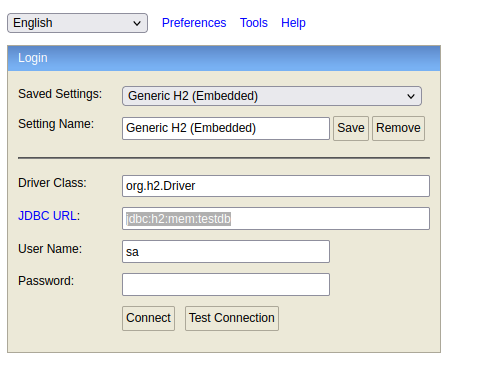
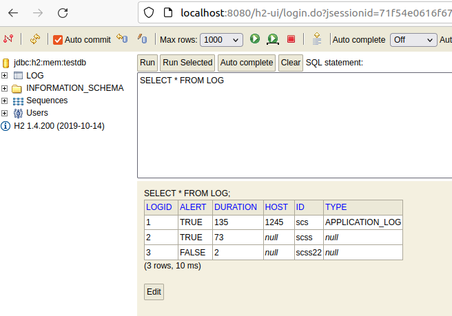

# Build and Run 
mvn clean install  
mvn spring-boot:run 

FileService is called from main class
To see output logon to h2console. 

## config 
change file path in application.properties  
default is set to file.path = src/main/resources/sample.txt

# h2 console
http://localhost:8080/h2-ui/

jdbc url :-
jdbc:h2:mem:testdb
 
username :- sa

